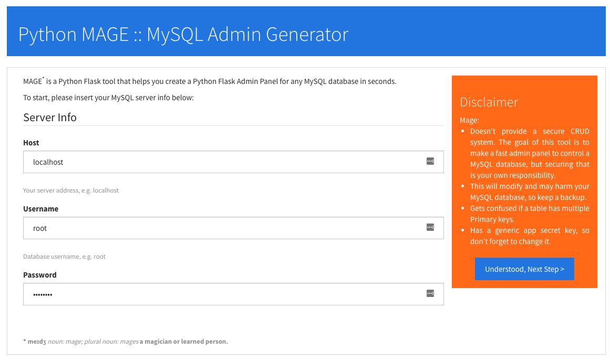
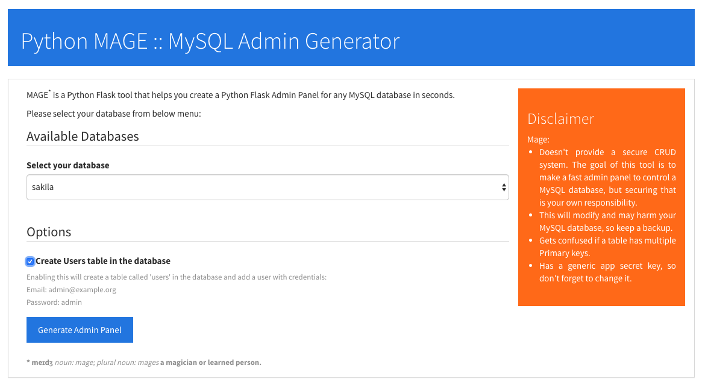
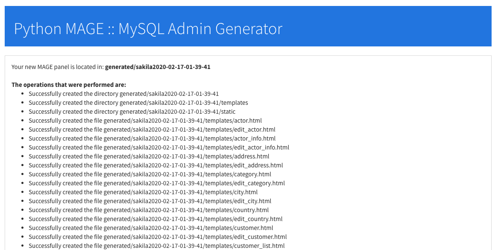
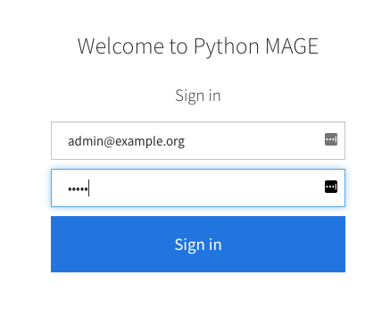
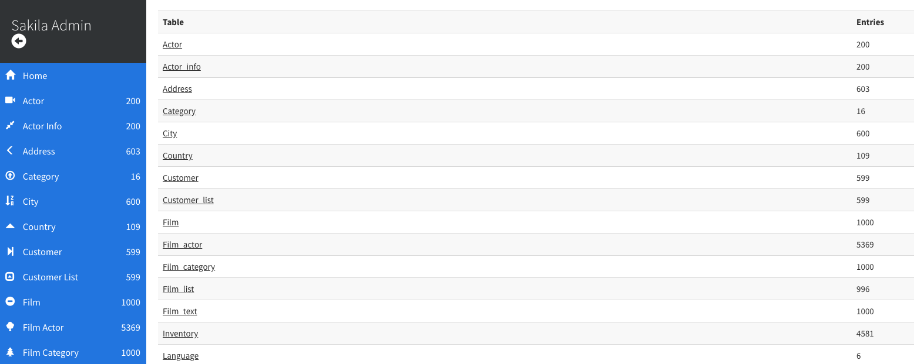
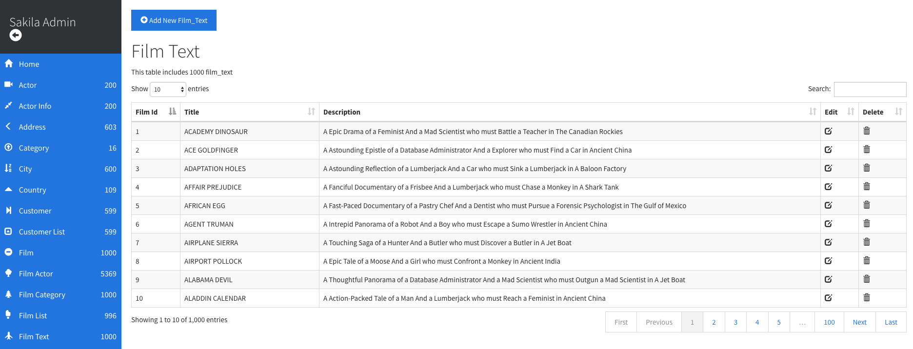
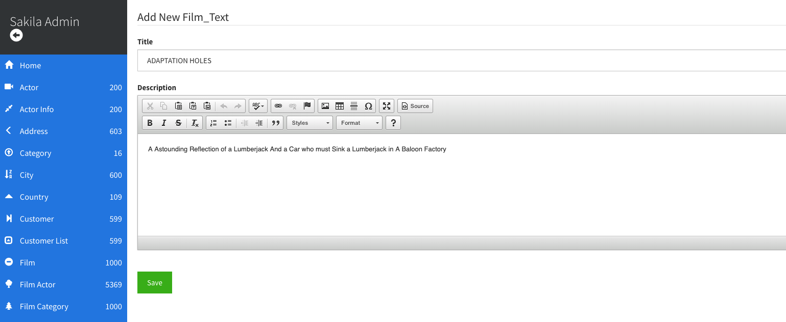

# Python MAGE :: MySQL Admin Panel Generator Version 0.3
Available for PHP also: [PHP Mage](https://github.com/housamz/php-mysql-admin-panel-generator)

Python MySQL Admin Panel Generator (MAGE), a Python tool that helps you create a Python Admin Panel for any MySQL database in seconds.

Mage is not like PHPMyAdmin; it doesn't contain all your databases. It physically creates an admin panel for a database.

A suggested use-case for the tool would be creating an admin panel for a Python Flask / MySQL project in seconds, and then you can tweak it before delivery.

You may use this tool for charity or school projects, for commercial use, please contact me.

### Name
MAGE is derived from `M`ySql `A`dmin panel `GE`nerator.
Mage (meɪdʒ): a magician or learned person.

### Disclaimer: Always backup your database.

## Running Mage
1- If you want, create a Virtual Environment and activate it, if not, please go to step 2  
`python3 -m venv env`  
`source env/bin/activate`  
  
2- Install the requirements  
`pip install -r requirements.txt`  

3- Run Mage  
`flask run -p 3009`

Mage can then be accessed on `http://localhost:3009`

## Instructions
1- Start by providing your MySQL Server Info, then click Next Step button.

2- The tool will scan the server for available databases and list them in a dropdown menu, select the database that you want, check if you want to create a 'users' table or not, and then click "Generate Admin Panel" button

3- After a few seconds, you'll get a success message, with a link to the newly created admin panel, and a report of all the operations that were done.

### Running your new application
1- If you want, create a Virtual Environment and activate it, if not, please go to step 2  
`python3 -m venv env`  
`source env/bin/activate`  
  
2- Install the requirements  
`pip install -r requirements.txt`  

3- Run the application  
`python app.py`  

4- Click the link to the admin panel. You have to sign in using "admin" as an email and a password.

---

You'll get a clean bootstrap interface to control the website, check below screenshots:  

---

---

## Notes
1- Mage and the generated applications are still in testing period.  
2- The generated app will run in debug mode, to change it, go to the last line on app.py and remove the `debug=True` from `app.run(debug=True)`